<!--
  Dr3amyBerry / GitHub profile
  Design system: midnight blue, electric cyan, soft violet.
  Original SVG illustrations are versioned in ./assets.
  No credentials, private project links or repository secrets are required.
-->

 

  

**Software is more than code. It is an idea, a system, and an experience.**

Creo productos digitales y exploro nuevas formas de convertir ideas en software real.

---

### `01 / WHAT DRIVES ME`

I work across **frontend, backend, mobile, and product design** — from the first concept to the details that make a product feel finished.

I care about clean architecture, thoughtful UX, useful automation, and software that remains maintainable after launch. My work spans **web platforms, mobile experiences, developer tools, and experimental engineering**.

  

### `02 / SELECTED WORK`

<table>
  <tr>
    <td width="50%" valign="top">
      <h3>⚡ <a href="https://rigorcore.com">RigorCore</a></h3>
      
Building practical digital products, platforms and experiences with an emphasis on quality, usability and scalability.

      <a href="https://rigorcore.com"><b>Explore website →</b></a>
    </td>
    <td width="50%" valign="top">
      <h3>🎮 <a href="https://github.com/Dr3amyBerry/Case-Recomp">Case-Recomp</a></h3>
      
An independent experimental Android compatibility project for <i>Mystery Case Files: Huntsville</i>, using files supplied by the user. Currently in beta.

      <a href="https://github.com/Dr3amyBerry/Case-Recomp"><b>View repository →</b></a>
    </td>
  </tr>
  <tr>
    <td width="50%" valign="top">
      <h3>🗜️ <a href="https://github.com/Dr3amyBerry/N64Compress">N64Compress</a></h3>
      
A small Python utility for packaging N64 ROM files into ZIP archives. Simple, focused tooling.

      <a href="https://github.com/Dr3amyBerry/N64Compress"><b>View repository →</b></a>
    </td>
    <td width="50%" valign="top">
      <h3>🤖 <a href="https://github.com/Dr3amyBerry/Dreamy-Bot">Dreamy-Bot</a></h3>
      
An early Python / Discord bot project — part of the journey that led me to building larger applications and systems.

      <a href="https://github.com/Dr3amyBerry/Dreamy-Bot"><b>View repository →</b></a>
    </td>
  </tr>
</table>

### `03 / TOOLKIT`

<table>
<tr>
<td width="21%"><strong>WEB</strong></td>
<td>TypeScript · JavaScript · React · Next.js · HTML/CSS</td>
</tr>
<tr>
<td><strong>MOBILE</strong></td>
<td>React Native · Expo · Kotlin</td>
</tr>
<tr>
<td><strong>BACKEND</strong></td>
<td>Node.js · Python · MongoDB · REST APIs</td>
</tr>
<tr>
<td><strong>WORKFLOW</strong></td>
<td>Git · GitHub · Linux · Docker · CI/CD</td>
</tr>
</table>

These are technologies I use or explore in my projects — not a claim of mastery in every tool.

### `04 / ACTIVITY & OPEN SOURCE`

I enjoy practical experimentation, contributing improvements and learning through real projects.

- **Projects and code:** [Public repositories](https://github.com/Dr3amyBerry?tab=repositories)
- **Open-source activity:** [Contributions and pull requests](https://github.com/Dr3amyBerry)
- **Achievements:** [GitHub achievement collection](https://github.com/Dr3amyBerry?tab=achievements)

<b>More about my work / Un poco más sobre mí</b>

 

My approach is simple: **understand the problem, design carefully, implement cleanly, test what matters, and keep improving.** I enjoy solving problems where engineering and experience design meet.

**En español:** Me gusta construir proyectos completos, no solo demostraciones. Disfruto trabajar tanto en interfaces como en infraestructura, investigar tecnologías nuevas y mejorar el rendimiento y la experiencia del usuario.

 

Built with Markdown + original SVG artwork · Designed to work without tokens, private APIs or scheduled workflows.

