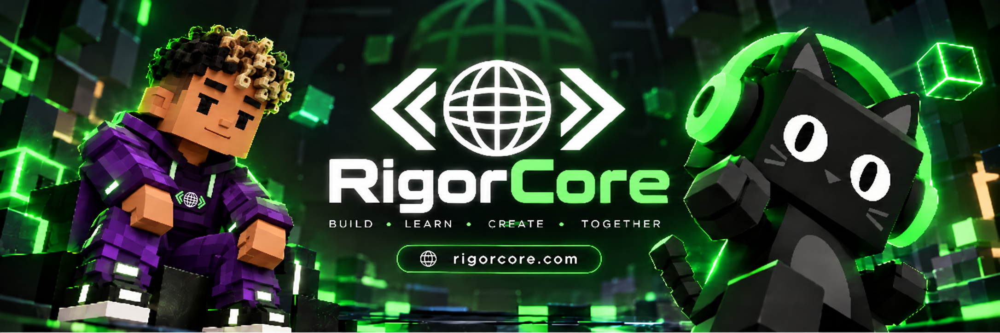
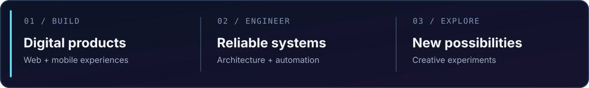
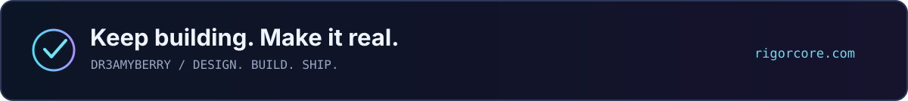

<!-- Perfil público de Dr3amyBerry. Diseño negro, verde neón y morado, inspirado en el banner de RigorCore. -->

  

# ¡Hola! Soy Dr3amyBerry 👋

**Me gusta convertir ideas en software que se pueda usar de verdad.**

Desarrollo web, aplicaciones móviles, backend y experiencias digitales con atención al diseño, la funcionalidad y los detalles.

---

### `01 / UN POCO SOBRE MÍ`

Disfruto crear proyectos completos: desde el diseño de las pantallas hasta la arquitectura del sistema que hay detrás. Me gusta investigar tecnologías nuevas, resolver problemas reales y mejorar el resultado con cada versión.

Mis intereses se centran en **desarrollo web y móvil**, **diseño de interfaces**, **automatización**, **herramientas para desarrolladores** y **proyectos experimentales**.

  

### `02 / PROYECTOS DESTACADOS`

<table>
<tr>
<td width="50%" valign="top">
<h3>⚡ <a href="https://rigorcore.com">RigorCore</a></h3>

Mi espacio para crear productos, plataformas y experiencias digitales. Busco combinar tecnología, buenas interfaces y soluciones prácticas.

<a href="https://rigorcore.com"><b>Visitar sitio web →</b></a>
</td>
<td width="50%" valign="top">
<h3>🎮 <a href="https://github.com/Dr3amyBerry/Case-Recomp">Case-Recomp</a></h3>

Proyecto experimental de compatibilidad para Android de <i>Mystery Case Files: Huntsville</i>. Utiliza archivos proporcionados por el usuario y continúa en fase beta.

<a href="https://github.com/Dr3amyBerry/Case-Recomp"><b>Ver código →</b></a>
</td>
</tr>
<tr>
<td colspan="2" valign="top">
<h3>🤖 <a href="https://github.com/Dr3amyBerry/Dreamy-Bot">Dreamy-Bot</a></h3>

Uno de mis primeros proyectos públicos: un bot para Discord desarrollado en Python. Parte de mi recorrido aprendiendo a programar.

<a href="https://github.com/Dr3amyBerry/Dreamy-Bot"><b>Ver código →</b></a>
</td>
</tr>
</table>

### `03 / TECNOLOGÍAS Y ACTIVIDAD`

Estas son algunas de las herramientas que utilizo o exploro en mis proyectos.

<table>
<tr><td width="23%"><b>WEB</b></td><td>JavaScript · TypeScript · React · Next.js · HTML · CSS</td></tr>
<tr><td><b>MÓVIL</b></td><td>React Native · Expo · Kotlin</td></tr>
<tr><td><b>BACKEND</b></td><td>Node.js · Python · MongoDB · API REST</td></tr>
<tr><td><b>HERRAMIENTAS</b></td><td>Git · GitHub · Linux · Docker · CI/CD</td></tr>
</table>

**Mi actividad en GitHub:** [repositorios](https://github.com/Dr3amyBerry?tab=repositories) · [contribuciones](https://github.com/Dr3amyBerry) · [logros](https://github.com/Dr3amyBerry?tab=achievements)

  

### `04 / MÁS SOBRE MI FORMA DE TRABAJAR`

<b>Leer un poco más</b>

Me gusta comenzar por entender el problema, planificar una solución y cuidar tanto la interfaz como la lógica interna. Prefiero construir con orden, documentar los cambios y revisar lo que se puede mejorar antes de dar algo por terminado.

Siempre encuentro algo nuevo que aprender, desde animaciones e interfaces hasta rendimiento, arquitectura y herramientas que hacen más sencillo el trabajo diario.

 

